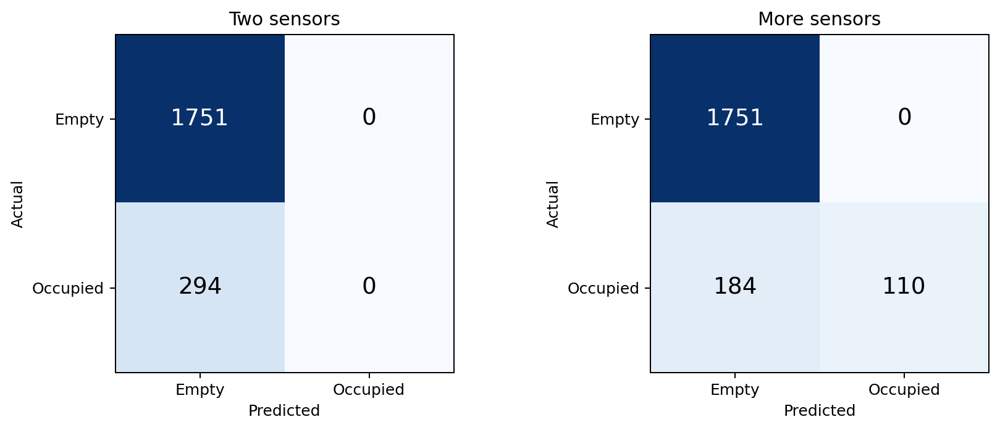

# Can a perceptron tell whether a room is occupied?

A Module 1 classification experiment using environmental sensors instead of a camera. The target is **empty (0)** or **occupied (1)**, converted from the recorded number of people.

## Open the notebook

Start with [room_occupancy.ipynb](room_occupancy.ipynb). It walks through the data, target labels, time split, scaling, training, and evaluation, with tables and figures displayed below each step. Explanations are in Chinese; plot labels are in English. Saved outputs are included for GitHub preview.


Use Python 3.10 or newer. From this assignment folder:

```bash
python3 -m venv .venv
source .venv/bin/activate
pip install -r requirements.txt
jupyter lab room_occupancy.ipynb
```

The dataset is included, so no account or download step is needed. Select the environment you installed above as the Python kernel. Use **Restart Kernel and Run All Cells** to reproduce the experiment. Figures and tables are saved to `results/`; rerunning overwrites the current result files.

The notebook is the main reading and editing entry point. `python occupancy.py` remains an optional script version of the original fixed experiment. If you change parameters in the notebook, the script will still use its own settings.

```bash
python -m unittest -v
```

## Experiment

| Model | Features |
| --- | --- |
| Two sensors | S1 temperature, CO₂ |
| More sensors | The same two features, plus S1 light, S1 sound, and both PIR motion sensors |

The second configuration uses six features covering five sensor types, not every column in the dataset. Using the same temperature/CO₂ channels in both configurations makes the addition explicit.

Both models use a binary perceptron with a learning rate of 0.01, 30 epochs, and random seed 1. These settings are fixed for this first comparison; no parameter search is performed on the test data. Training rows are shuffled within each epoch. We use the final weights after epoch 30, not the weights that score best on the test set.

### Data split

- Training: all December 2017 observations.
- Testing: all January 2018 observations.
- Standardization: subtract the training mean and divide by the training standard deviation. Apply those same values to test rows.

This keeps adjacent observations out of a random train/test mixture. The two periods still come from the same room, and readings within each period are correlated. The test is a later-period check, not a test of generalization to other buildings.

### What to measure

An always-empty prediction is included as a baseline because most observations are empty. Alongside accuracy, the script reports:

- **Occupied recall:** fraction of occupied observations detected.
- **Occupied precision:** fraction of occupied predictions that are correct. Reported as 0 when no occupied predictions exist.
- **Balanced accuracy:** average of occupied recall and empty recall.
- **False empty:** someone is present, but the model predicts empty.
- **False occupied:** the room is empty, but the model predicts occupied.

A false-empty observation could correspond to a light turning off while someone is present. A false-occupied observation could keep lights on unnecessarily. The dataset does not measure those outcomes; they are possible implications of using such a classifier in a product. Misclassified rows are sensor readings, not counts of distinct incidents.

## First run

Training uses 8,084 observations, including 1,607 occupied rows. Testing uses 2,045 observations, including 294 occupied rows.

| Model | Test accuracy | Occupied recall | Balanced accuracy | False empty | False occupied |
| --- | ---: | ---: | ---: | ---: | ---: |
| Always empty | 85.62% | 0.00% | 50.00% | 294 | 0 |
| Two sensors | 85.62% | 0.00% | 50.00% | 294 | 0 |
| More sensors | 91.00% | 37.41% | 68.71% | 184 | 0 |

The two-feature model predicts empty for every test observation. Adding sensors detects 110 of 294 occupied observations, but still misses 184. The apparent 91% accuracy therefore does not mean the system detects most occupied periods. These are results for one fixed seed and one chronological split, not a claim that these settings are optimal.



## Code map

- `room_occupancy.ipynb`: the main experiment, organized into short executable steps.
- `perceptron.py`: `fit`, `net_input`, and `predict`, with one weight per feature and one bias.
- `occupancy.py`: load the data, make the time split, scale features, train both models, and export results.
- `plot_results.py`: decision regions, update curves, confusion matrices, and predictions over time.
- `test_occupancy.py`: small checks of the update rule, scaling, time split, and error counts.
- `data/README.md`: dataset citation, license, and column descriptions.

The implementation follows the Module 1 structure shown by Thanassis Rikakis in `perceptron_gen_w_shuffle.py` and the Iris plotting examples: a small NumPy class, explicit update loop, separate experiment and plotting scripts. Comments and the surrounding experiment are written for this project. Training visits a fresh permutation of original row indices each epoch, so its shuffle sequence is not identical to the instructor's in-place reorder sequence. The learning rule is the same:

```python
update = self.eta * (target - self.predict(xi))
self.w_ += update * xi
self.b_ += update
```

Course slides and original instructor files are not bundled. This repository's code and documentation were prepared with AI assistance and should be reviewed and understood before submission.

## Reading the figures

- `decision_regions.png`: the two-feature model on test observations. Point colors show **actual labels**; background colors show predictions. This is a two-dimensional model, not a projection of the six-feature classifier.
- `training_updates.png`: mistakes encountered while the parameters are changing during each epoch. This is not the final fixed model's training error or MSE.
- `confusion_matrices.png`: rows are actual labels; columns are predictions.
- `test_timeline.png`: true occupancy and both predictions, separated by recorded day. Prediction lines are slightly offset for readability.

`metrics.csv`, `test_predictions.csv`, `training_updates.csv`, `parameters.json`, and `split.json` record the numbers behind the figures. Saved weights operate on standardized inputs; each model's training mean and standard deviation are included.

A perceptron can be evaluated even if the training classes are not linearly separable. In that case, updates may continue throughout training. More features do not guarantee better later-period results.

## Dataset

Singh, A. & Chaudhari, S. (2018). *Room Occupancy Estimation*. [UCI](https://doi.org/10.24432/C5P605), licensed under [CC BY 4.0](https://creativecommons.org/licenses/by/4.0/). See [data notes](data/README.md) for the timestamp discrepancy in the original description.
